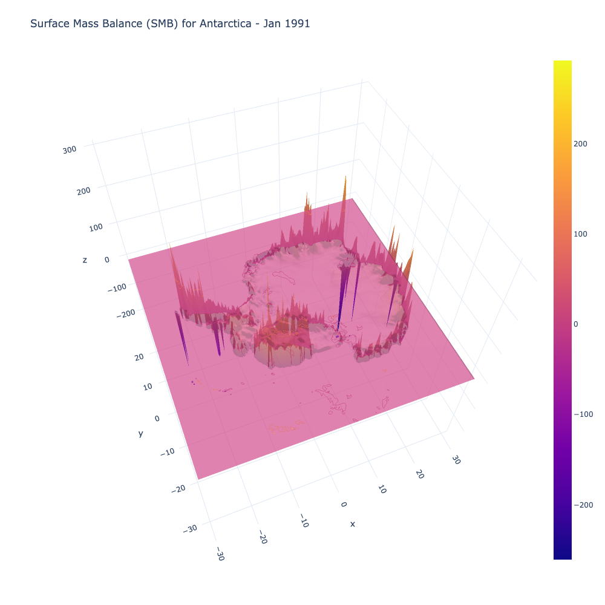

<!-- ABOUT THE PROJECT -->
# SMB emulator

Emulation of surface mass balance (smb)

## Keywords: 
- Probabilistc Machine Learning
- Downscaling
- Regional Climate Models (RCMs)
- Cryosphere
- Antarctica

<!-- CONTACT -->
## Contact

kim.bente@sydney.edu.au

## Code

![PyTorch][pytorch.py]
![Python][python.py]

## License

![MIT License][license-shield]

<!-- MARKDOWN LINKS & IMAGES -->
<!-- https://www.markdownguide.org/basic-syntax/#reference-style-links -->
[license-shield]: https://img.shields.io/github/license/othneildrew/Best-README-Template.svg?style=for-the-badge
[pytorch.py]: https://img.shields.io/badge/PyTorch-0769AD?style=for-the-badge&logo=PyTorch&logoColor=white
[python.py]: https://img.shields.io/badge/Python-563D7C?style=for-the-badge&logo=python&logoColor=white

